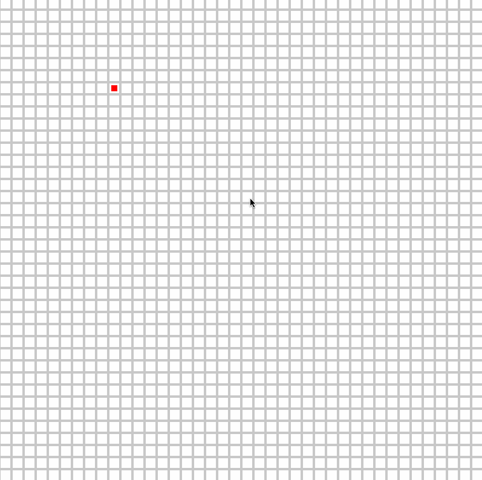

# Some pygame examples
## Maze generation
`maze.py` uses a random walk with traceback to generate a maze map.

To run
```
python game/maze.py
```
Press [SPACE] to start generating a maze from a uniform grid.



## Pathfinding
`pathfinding.py` uses the A* method to calculate how to get for a destination to target, when there are obstacles in the way.

To run
```
python game/pathfinding.py
```

Click anywhere to create white blocks that are treated as impassables. When finished press [SPACE] for the red box to find the green box.
